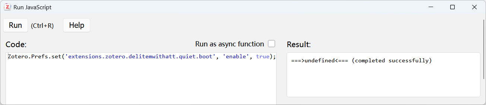

# Delete item(s) with attachment(s)

# 注意：

[最新版](https://github.com/redleafnew/delitemwithatt/releases/latest)仅支持Zotero 7.0及以上版本, Zotero 6.0请下载[0.1.06](https://github.com/redleafnew/delitemwithatt/releases/tag/0.1.06)。

# 安装及设置

点击下方链接下载插件.xpi文件，然后在Zotero或JurisM中通过工具-插件-Install Plugin From File...安装。

   - [最新版](https://github.com/redleafnew/delitemwithatt/releases/latest)
   - [历史版本](https://github.com/redleafnew/delitemwithatt/releases)

   *注意*：火狐浏览器用户请通过在链接上右击，选择“另存为”来下载 .xpi 文件。

**插件静默启动设置**，即关闭Zotero软件启动时右下角的Del ltem With Attachment插件启动进度弹窗

   - 静默启动设置：在`Zotero`中点击`工具`-`开发者`-`Run JavaScript`，输入以下内容，点击左上角的`执行/Run`即可：

     `Zotero.Prefs.set('extensions.zotero.delitemwithatt.quiet.boot', 'enable', true); // 开启插件静默启动`

# 插件用途

1. 删除条目或分类的同时将附件（包括链接的附件）一块删除。

   - 在条目上右击会出现：`删除附件`，如果条目有附件，会出现6个子菜单，`删除附件和条目(Alt/⌥+I)`，`仅删除所有附件(Alt/⌥+A)`，`仅删除快照(Alt/⌥+S)`，`仅删除笔记(Alt/⌥+N)`，`清空“摘要”字段(Alt/⌥+Z)`，`清空“其他”字段(Alt/⌥+X)`，点击后对应的条目包括附件、附件、快照或笔记会被删除（包括文件）
   - 在分类上右击会出现：`删除分类包括附件`，确认后会在删除分类的同时将分类中的条目包含附件删除，快照也认为是附件。

    > **注意：删除时链接文件不进回收站，直接删除，请删除前备份**。

   不同操作系统下的插件默认快捷键：

    | 功能            | Windows/Linux系统快捷键 | MacOS快捷键 | MacOS备用快捷键 |
    | --------------- | ---------------------- | -------------- |------------------- |
    | 删除附件和条目   | `Alt+I`                | `⌥+I`          | `⇧+⌥+I`           |
    | 仅删除所有附件   | `Alt+A`                | `⌥+A`          | `⇧+⌥+A`           |
    | 仅删除快照       | `Alt+S`                | `⌥+S`          | `⇧+⌥+S`           |
    | 仅删除笔记       | `Alt+N`                | `⌥+N`          | `⇧+⌥+N`           |
    | 清空“摘要”字段   | `Alt+Z`                | `⌥+Z`          | `⇧+⌥+Z`           |
    | 清空“其他”字段   | `Alt+X`                | `⌥+X`          | `⇧+⌥+X`           |

    对于MacOS，以上快捷键不支持自定义修改，提供备用快捷键以防默认快捷键被占用

    对于Windows/Linux系统，以上快捷键支持自定义修改为`Alt+其他快捷字母`，修改方法如下：

    在`Zotero`中点击`工具`-`开发者`-`Run JavaScript`，输入以下内容并修改快捷键字母，点击左上角的`执行/Run`即可：

    `Zotero.Prefs.set('extensions.zotero.delitemwithatt.key.del.item.att', 'I', true); // 修改删除条目和附件默认快捷键，修改I为预设置的快捷字母`

    `Zotero.Prefs.set('extensions.zotero.delitemwithatt.key.del.att', 'A', true); // 修改删除附件默认快捷键，修改A为预设置的快捷字母`

    `Zotero.Prefs.set('extensions.zotero.delitemwithatt.key.del.snap', 'S', true); // 修改删除快照默认快捷键，修改S为预设置的快捷字母`

    `Zotero.Prefs.set('extensions.zotero.delitemwithatt.key.del.note', 'N', true); // 修改删除笔记默认快捷键，修改I为预设置的快捷字母`

    `Zotero.Prefs.set('extensions.zotero.delitemwithatt.key.del.extra', 'X', true); // 修改删除其它默认快捷键，修改X为预设置的快捷字母`

    `Zotero.Prefs.set('extensions.zotero.delitemwithatt.key.del.abs', 'Z', true); // 修改删除摘要默认快捷键，修改Z为预设置的快捷字母`

2. 根据条目标题语言将所选条目语言字段设置为`en-US`或`zh-CN`。

3. 将附件导出。

# 感谢

本插件基于@windingwind的[zotero-plugin-template](https://github.com/windingwind/zotero-plugin-template)开发，在此表示感谢。

# Reminder：

The latest version only supports Zotero 7.0 (or later versions), Zotero 6.0 users could download [0.1.06](https://github.com/redleafnew/delitemwithatt/releases/tag/0.1.06)。

# Installation

Download the plugin (.xpi file) from below, and click Tools-Plugins-Install Plugins From File... in Zotero or JurisM to install the plugin.

   - [Latest Version](https://github.com/redleafnew/delitemwithatt/releases/latest)
   - [All Releases](https://github.com/redleafnew/delitemwithatt/releases)

   *Note*: If you're using Firefox as your browser, right-click the `.xpi` and select "Save As.."
# Usage

1. Remove attachment(s) (including linked attachments) when delete the item(s) or collection.

   - When you right-click item(s), you can find `Delete Attachment(s)` in the context menu. If there is/are attachment(s) attached to the item(s), there will be 6 submenus, `Delete Attachment(s) and Item(s)(Alt/⌥+I)`, `Delete All Attachment(s) only(Alt/⌥+A)`, `Delete Snapshot(s) only(Alt/⌥+S)`, `Delete Note(s) only(Alt/⌥+N)`, `Empty "Abstract" Field(s)(Alt/⌥+Z)`, `Empty "Extra" Field(s)(Alt/⌥+X)`, when confirm, the item(s), attachment(s), snapshot(s) or note(s) will be deleted; 
   - When you right-click collection, you can find `Delete Collections with Attachments` in the context menu. When confirm, the collection and the item(s) with attachment(s) in the selected collection will be deleted. Snapshot is also regarded as attachment.

    > **Note: the linked files could not be restored, they will be removed directly, please backup before removing.**

2. Set the language field of selected items as `en-US` or `zh-CN` according to the language of item title.

3. Export attachment(s).

# Disclaimer

This plugin based on @windingwind's [zotero-plugin-template](https://github.com/windingwind/zotero-plugin-template)，many thanks for his team's hard working。

# License

The source code is released under GNU General Public License, version 3.0

Contributions preferably through pull requests are welcome!
